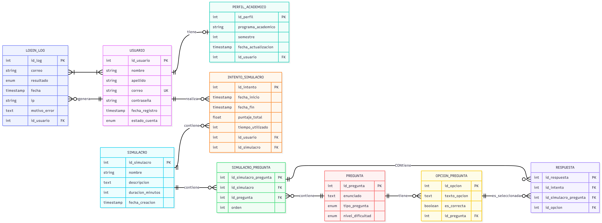

# DeepSaffix
### Optimización Inteligente para Pruebas Saber Pro

 

**Una plataforma especializada que centraliza recursos, analiza resultados y estructura la preparación académica para maximizar el desempeño estudiantil.**

[Explorar Documentación](#) · [Reportar un Bug](#) · [Solicitar Funcionalidad](#)

---

## Visión del Producto

**DeepSaffix** es una herramienta diseñada para agilizar y estructurar el proceso de preparación para la prueba **Saber Pro**. A diferencia de los métodos tradicionales, nuestra plataforma especializada analiza resultados y refuerza actividades de alto impacto, optimizando el tiempo de estudio y haciendo más eficiente el esfuerzo del estudiante para alcanzar la excelencia académica.

---

## Planteamiento del Problema
> *"La presentación de las pruebas Saber Pro es un requisito fundamental para titularse en Colombia. Alcanzar un alto desempeño requiere que el estudiante refuerce sus conocimientos, realice simulacros y analice sistemáticamente sus resultados. 

Sin embargo, actualmente no existe una plataforma especializada que acompañe al estudiante en estas actividades de forma estructurada y eficiente, lo que genera procesos de preparación poco optimizados y una inversión innecesariamente alta de tiempo y esfuerzo para lograr buenos resultados.
"*

Identificamos tres barreras principales:
1.  **Falta de Centralización:** Los recursos están dispersos, dificultando el estudio autónomo.
2.  **Procesos no Optimizados:** Los estudiantes invierten tiempo ineficiente en temas que no dominan o que ya conocen, sin un análisis de datos.
3.  **Ausencia de Seguimiento:** No hay herramientas que permitan un análisis sistemático de los simulacros.

**Nuestra Solución:** DeepSaffix es una herramienta que agiliza y estructura el proceso de preparación para la prueba Saber Pro. A través de una plataforma especializada, analiza resultados y refuerza actividades de alto impacto, optimizando el tiempo de estudio y haciendo más eficiente el esfuerzo del estudiante para alcanzar un mejor desempeño.

---

## 🛠️ Stack Tecnológico

El proyecto está construido utilizando una arquitectura moderna, escalable y robusta:

| Área              | Tecnologías                                                                                                                                                                                    |
| :---------------- | :--------------------------------------------------------------------------------------------------------------------------------------------------------------------------------------------- |
| **Frontend**      |                                                                                            |
| **Backend**       |                                                                                 |
| **Base de Datos** |                                                                                 |
| **Herramientas**  |   |

---

## 👥 Equipo de Desarrollo (Grupo 2)

Somos un equipo interdisciplinario apasionado por el desarrollo de software y la educación.

<table align="center">
<tr>
    <td align="center" width="200px">
      
       
      <b>Daniel Alejandro Lasso</b>
       
      <small>Backend Developer</small>
       
      
    </td>
    <td width="600px">
      <b>Especialista Backend (Node.js & Django).</b> 
      Desarrollador con dominio en TypeScript, JavaScript y Python. Especializado en crear aplicaciones robustas y manejo experto de bases de datos relacionales (PostgreSQL, MySQL) y administración de Linux.
    </td>
  </tr>
    <td align="center" width="200px">
      
       
      <b>Henry Fabian Guillen</b>
       
      <small>Backend</small>
       
      
    </td>
    <td width="600px">
      Desarrollador de software con enfoque en <b>Backend e Inteligencia Artificial</b>. Trabajo principalmente con Python, Java y PostgreSQL. Me interesa diseñar soluciones escalables, eficientes y basadas en datos.
    </td>
  </tr>
  <tr>
    <td align="center" width="200px">
      
       
      <b>Omar Jhon Hualpa</b>
       
      <small>Software Developer</small>
       
      
    </td>
    <td width="600px">
      Interés en aplicaciones web y arquitectura de sistemas. Experiencia en C#, .NET y SQL. Enfocado en soluciones modulares, eficientes y mantenibles, integrando buenas prácticas de desarrollo colaborativo.
    </td>
  </tr>
  <tr>
    <td align="center" width="200px">
      
       
      <b>Marily Yojana Botina</b>
       
      <small>Frontend Focus</small>
       
      
    </td>
    <td width="600px">
      Enfoque principal en <b>Frontend</b>. Conocimientos básicos en Python y PostgreSQL. Motivada por fortalecer habilidades técnicas y profundizar en metodologías ágiles para mejorar la calidad y organización del desarrollo.
    </td>
  </tr>
  <tr>
    <td align="center" width="200px">
      
       
      <b>Nidia Jael Muñoz</b>
       
      <small>Software Developer</small>
       
      
    </td>
    <td width="600px">
      Entusiasta del desarrollo de software con conocimientos en Python, JavaScript, TypeScript y PostgreSQL. Interesada en fortalecer habilidades a través de proyectos prácticos.
    </td>
  </tr>
</table>

---

## Arquitectura de Datos

El núcleo de DeepSaffix se basa en una estructura relacional sólida diseñada para soportar usuarios, pruebas, preguntas y análisis de resultados.

*Diagrama Entidad-Relación (DER) de DeepSaffix*

---

  <small>© 2024 DeepSaffix - Grupo 2. Todos los derechos reservados.</small>

